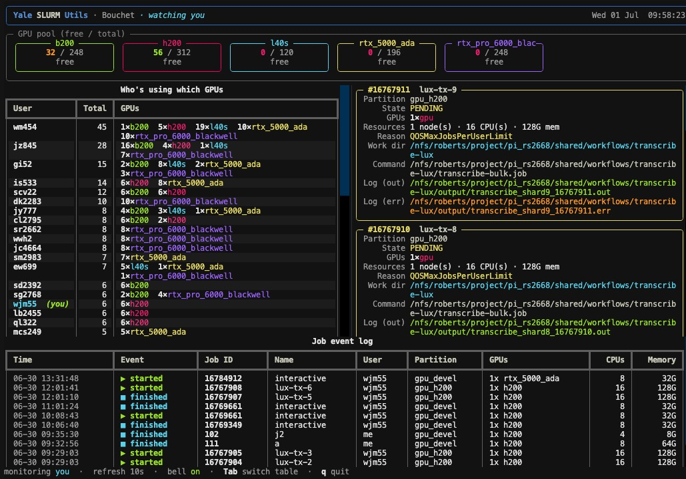
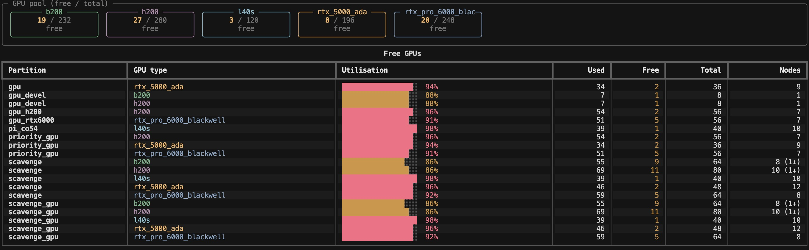

# Yale SLURM Utils

Beautifully formatted, real-time SLURM stats for the Yale
[Bouchet](https://docs.ycrc.yale.edu/clusters/bouchet/) cluster — and any other
SLURM deployment. Built on [Rich](https://github.com/Textualize/rich), it gives
you partition breakdowns, GPU availability, "who's using which GPU", and a live
dashboard that **dings** when your jobs start or finish.

```
ysu                 # quick overview (GPUs + partitions + your jobs)
ysu gpus            # GPU availability per partition & type
ysu gpus --free     # only the free GPUs
ysu gpus --users    # who is using which GPUs
ysu free            # shortcut for the free GPUs
ysu grab            # grab an interactive GPU via salloc (any free GPU)
ysu grab --list     # see every GPU config you could ask for
ysu partitions      # partition breakdown (nodes / CPU / memory / GPUs)
ysu list-partitions # just the partition names
ysu jobs            # your jobs: GPUs, source dir, log files, time left
ysu watch           # live dashboard + terminal bell on job start/finish
ysu watch -I        # interactive: scroll your jobs and cancel one
ysu log             # persistent log of job start/finish events
```

## Highlights

- **Partition breakdown** — node states, CPU utilisation bars, memory and GPU
  free/total at a glance.
- **GPU availability** — per partition and per GPU model (`h200`, `b200`,
  `rtx_pro_6000_blackwell`, `rtx_5000_ada`, `l40s`, ...), with utilisation bars
  and an at-a-glance "free / total" pool summary.
- **Who's using what** — a leaderboard of users ranked by GPUs in use, with your
  own row highlighted.
- **Your jobs** — for each job: the GPUs allocated, the **working directory** the
  job was submitted from, the **log files** (`StdOut`/`StdErr`), the command, and
  the **time left** shown both as a percentage bar and a duration.
- **Real-time watch** — a full-screen [Textual](https://textual.textualize.io/)
  dashboard that polls SLURM on an interval, **rings the terminal bell** when one
  of your jobs starts or finishes, and keeps a timestamped event log. Every table
  is **scrollable** and you can **Tab** between them; with `--interactive` you can
  scroll your jobs and cancel one.
- **Themeable** — light/dark auto-detection plus built-in themes (`dracula`,
  `nord`, `solarized`, ...) and your own YAML themes; see `ysu theme list`.
- **Grab a GPU** — `ysu grab` wraps `salloc` to drop you into an interactive
  GPU session. By default it grabs **any** free GPU; narrow it with `-g h200`,
  `-n 2`, `-t 2h`, `-m 64G`. Mistype a GPU type or partition and it tells you
  the real options (and suggests the closest match) instead of failing cryptically.
- **Filter anything** — every command accepts `--partition/-p`, e.g.
  `--partition gpu_h200`.

## Dasboards

### YSU Dashboard



### GPU Dashboard




## Requirements

- Run it on a machine with the SLURM client tools (`sinfo`, `squeue`) on `PATH`,
  i.e. a Bouchet login node.
- Python ≥ 3.10.

## Install once, use anywhere (recommended on HPC)

On a cluster your home directory is shared across every login and compute node,
so installing `ysu` into `~/.local/bin` makes it available everywhere — from any
directory, with no virtual environment to activate first. Just:

```bash
./install.sh            # from a checkout of this repo
# then, from anywhere:
ysu free
```

`install.sh` is self-locating (run it from any directory), builds the package
into its own isolated environment via `uv tool install`, and ensures
`~/.local/bin` is on your `PATH`. Re-run it any time to upgrade after pulling
new changes — it replaces any previous (or broken) install.

Under the hood it is just:

```bash
uv tool install --force /path/to/yale-slurm-utils
uv tool update-shell    # adds ~/.local/bin to PATH if needed
```

> If `ysu` reports a `bad interpreter` error, the tool's isolated Python was
> pruned (common on HPC scratch/cache cleanups). Just re-run `./install.sh` to
> rebuild it.

## Run with `uv` (no install)

The fastest path — run straight from the repo without installing anything:

```bash
uv run ysu                       # overview
uv run ysu gpus --free
uv run ysu watch --partition gpu_h200
```

Or add it to a project:

```bash
uv add yale-slurm-utils
```

You can also run it as a module:

```bash
uv run python -m yale_slurm_utils gpus
```

## Examples

Watch only the H200 partition, refresh every 5 seconds:

```bash
ysu watch --partition gpu_h200 --interval 5
```

See another user's jobs, or all jobs in a partition as a compact table:

```bash
ysu jobs --user abc123
ysu jobs --all --partition gpu_b200 --table
```

Disable the bell while watching:

```bash
ysu watch --no-bell
```

### The watch dashboard (Textual)

`ysu watch` is a full-screen [Textual](https://textual.textualize.io/) app. Every
table (GPU users, jobs, event log) is independently **scrollable**, and you can
**Tab** between them:

| Key | Action |
| --- | --- |
| `Tab` / `Shift-Tab` | move focus to the next / previous table |
| `↑`/`↓`, `PgUp`/`PgDn`, mouse wheel | scroll the focused table |
| `q` or `Ctrl-C` | quit |

The app matches your terminal's light/dark background automatically and follows
your chosen [theme](#themes).

### Interactive watch (scroll + cancel)

`ysu watch --interactive` (or `-I`) adds a movable cursor to your jobs table so
you can select a job and cancel it:

```bash
ysu watch --interactive
```

| Key | Action |
| --- | --- |
| `↑`/`↓` or `k`/`j` | move the cursor between jobs (when the jobs table is focused) |
| `c` (or `x`) | cancel the highlighted job (asks first, keyboard or mouse) |
| `Tab` | switch to another table (then arrows scroll it normally) |
| `q` or `Ctrl-C` | quit |

You can only cancel your **own** jobs — selecting someone else's (in `--all`
view) and pressing `c` just shows a notice.

## Themes

`ysu` ships several colour themes and, by default, auto-detects whether your
terminal has a light or dark background (via `COLORFGBG` / an OSC 11 query) and
picks a matching one.

```bash
ysu theme list                 # see all themes + a live preview swatch
ysu theme show dracula         # preview a theme with sample tables
ysu theme set nord             # switch and remember it
ysu theme set auto             # go back to light/dark auto-detection
ysu --theme light free         # use a theme for a single command only
```

Built-in themes: `dark`, `yale` (Yale-blue + gold), `light`, `solarized-dark`,
`solarized-light`, `dracula`, `nord`, `gruvbox-dark`. Your choice is remembered in
`$XDG_CONFIG_HOME/yale-slurm-utils/config.json`.

### Your own themes (YAML)

```bash
ysu theme path                 # prints the themes dir + a ready-to-copy example
```

Drop a `<name>.yaml` file in `~/.config/yale-slurm-utils/themes/` and select it
with `ysu theme set <name>`. Only the keys you want to change are required — the
rest inherit the dark defaults. Colours may be names (`bright_green`) or hex
(`"#5aa2ff"`).

```yaml
# ~/.config/yale-slurm-utils/themes/midnight.yaml
name: midnight
mode: dark            # dark | light (also sets the app background)
accent: "#5aa2ff"     # branding / focused borders
heading: "white"
border: "grey37"      # table borders
zebra: "grey15"       # alternating row background
selection: "grey30"   # highlighted (selected) row background
idle: "green"
allocated: "bright_red"
pending: "bright_yellow"
util_hot: "bright_red"
avail_plenty: "bright_green"
gpu_palette: ["bright_green", "bright_cyan", "bright_magenta", "bright_yellow"]
```

## Grab a GPU (`ysu grab`)

`ysu grab` builds and runs an interactive `salloc` for you, with validation and
helpful suggestions. The default just grabs **any** free GPU:

```bash
ysu grab                              # any free GPU · 6h · 8 CPUs · 32G
ysu grab --free                       # list the free GPUs and pick one
ysu grab -g h200 -n 2                 # two H200s
ysu grab -p gpu_devel -t 2h -m 64G    # pin a partition, 2h, 64G RAM
ysu grab --list                       # show every allocatable GPU config
ysu grab --dry-run                    # print the salloc command, run nothing
```

### Pick from what's free

`ysu grab --free` shows the GPUs that are free **right now** on the interactive
(`devel`) partitions and prompts you to choose one to grab:

```text
                Free GPUs on the interactive (devel) partitions
  #   Partition    GPU type        Free   Availability
  1   gpu_devel    h200               3   ████░░░░░░░░░░░░
  2   gpu_devel    rtx_5000_ada       2   ░░░░░░░░░░░░░░░░
Which GPU? [1-2, q to cancel] [1]:
```

Pick a number and it grabs exactly that GPU on that partition. Combine with
`-g`/`-p` to pre-filter the list, `-a` to include every partition (not just the
interactive ones), or `-y` to auto-pick the option with the most free GPUs.

Options:

| Flag | Meaning | Default |
| --- | --- | --- |
| `-g, --gpu TYPE` | GPU model (`h200`, `b200`, …) | any GPU |
| `-n, --num N` | number of GPUs | `1` |
| `-p, --partition NAME` | pin to one partition | any partition that has the GPU |
| `-t, --time` | wall time: `6`, `2h`, `30m`, `6:00:00`, `1-00:00:00` | `6:00:00` |
| `-c, --cpus N` | CPUs per task | `8` |
| `-m, --mem` | memory: `32G`, `64G`, `500M`, `1T`, or `0` for all | `32G` |
| `-A, --account` | charge account | (none) |
| `-a, --all-partitions` | search every partition, not just interactive ones | |
| `-f, --free` | list the free GPUs and pick one to grab | |
| `--dry-run` | print the `salloc` command without running | |
| `-y, --yes` | skip the confirmation prompt | |

When you don't pin a partition, `ysu grab` targets the **interactive (`*devel`)
partitions** — on Bouchet that's `gpu_devel`. Batch-only partitions such as
`scavenge` or `priority_gpu` reject interactive `salloc` jobs with a QOS policy
error, so they're excluded by default. Pass `-a/--all-partitions` to fan the
request across every partition that can satisfy it (SLURM then grabs whichever
GPU frees up first), or pin one with `-p`.

If you ask for a GPU type or partition that doesn't exist (or a combination that
can't work), it prints the real configurations you could pick from — try
`ysu grab --list` to see them up front. `ysu alloc` is an alias for `ysu grab`.

## Python API

Everything the CLI does is available as a small typed library:

```python
from yale_slurm_utils import get_jobs, gpu_inventory, get_partitions

for gc in gpu_inventory(partition="gpu_h200"):
    print(gc.partition, gc.gpu_type, gc.free, "/", gc.total)

for job in get_jobs():  # your jobs
    print(job.job_id, job.gpu_label, job.percent_elapsed(), "% used")
    print("  workdir:", job.workdir)
    print("  log:", job.stdout)
```

## How it works

- `sinfo -N -O '...'` gives per-node state, CPU/memory and `Gres`/`GresUsed`
  (parsed into per-GPU-type totals and usage).
- `squeue -O '...'` gives jobs with `tres-alloc` (parsed for `gres/gpu:<type>`
  and `mem=` so CPUs and memory show up alongside GPUs), plus `WorkDir`,
  `STDOUT`, `STDERR` and `Command`.
- Log paths from SLURM are filename *templates* (`transcribe_%A_%a.out`); the
  `%j`/`%A`/`%a`/`%x`/`%u`/`%N` tokens are resolved from the job's own fields so
  you see a real path instead of the pattern.
- All output uses a `|`-delimited format to stay robust against wide values.
- The event log is stored as JSON lines under
  `$XDG_STATE_HOME/yale-slurm-utils/events.jsonl`
  (default `~/.local/state/yale-slurm-utils/events.jsonl`).

## Development

```bash
uv sync
uv run pytest
```

## License

MIT
