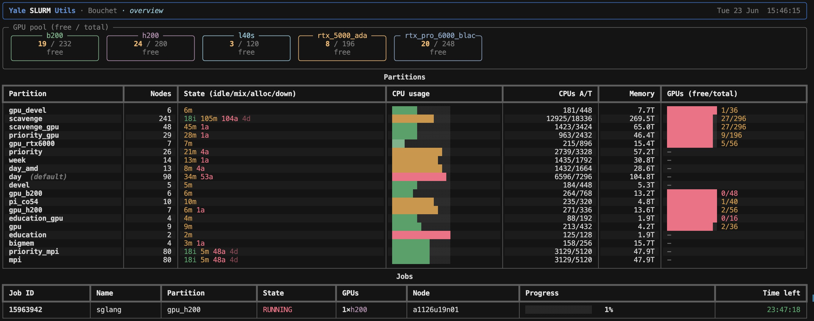

# Yale SLURM Utils

Beautifully formatted, real-time SLURM stats for the Yale
[Bouchet](https://docs.ycrc.yale.edu/clusters/bouchet/) cluster — and any other
SLURM deployment. Built on [Rich](https://github.com/Textualize/rich), it gives
you partition breakdowns, GPU availability, "who's using which GPU", and a live
dashboard that **dings** when your jobs start or finish.

```
ysu                 # quick overview (GPUs + partitions + your jobs)
ysu gpus            # GPU availability per partition & type
ysu gpus --free     # only the free GPUs
ysu gpus --users    # who is using which GPUs
ysu free            # shortcut for the free GPUs
ysu partitions      # partition breakdown (nodes / CPU / memory / GPUs)
ysu list-partitions # just the partition names
ysu jobs            # your jobs: GPUs, source dir, log files, time left
ysu watch           # live dashboard + terminal bell on job start/finish
ysu log             # persistent log of job start/finish events
```

## Highlights

- **Partition breakdown** — node states, CPU utilisation bars, memory and GPU
  free/total at a glance.
- **GPU availability** — per partition and per GPU model (`h200`, `b200`,
  `rtx_pro_6000_blackwell`, `rtx_5000_ada`, `l40s`, ...), with utilisation bars
  and an at-a-glance "free / total" pool summary.
- **Who's using what** — a leaderboard of users ranked by GPUs in use, with your
  own row highlighted.
- **Your jobs** — for each job: the GPUs allocated, the **working directory** the
  job was submitted from, the **log files** (`StdOut`/`StdErr`), the command, and
  the **time left** shown both as a percentage bar and a duration.
- **Real-time watch** — a full-screen live dashboard that polls SLURM on an
  interval, **rings the terminal bell** when one of your jobs starts or finishes,
  and keeps a timestamped event log.
- **Filter anything** — every command accepts `--partition/-p`, e.g.
  `--partition gpu_h200`.

## Dasboards

### YSU Dashboard



### GPU Dashboard


## Requirements

- Run it on a machine with the SLURM client tools (`sinfo`, `squeue`) on `PATH`,
  i.e. a Bouchet login node.
- Python ≥ 3.10.

## Install once, use anywhere (recommended on HPC)

On a cluster your home directory is shared across every login and compute node,
so installing `ysu` into `~/.local/bin` makes it available everywhere — from any
directory, with no virtual environment to activate first. Just:

```bash
./install.sh            # from a checkout of this repo
# then, from anywhere:
ysu free
```

`install.sh` is self-locating (run it from any directory), builds the package
into its own isolated environment via `uv tool install`, and ensures
`~/.local/bin` is on your `PATH`. Re-run it any time to upgrade after pulling
new changes — it replaces any previous (or broken) install.

Under the hood it is just:

```bash
uv tool install --force /path/to/yale-slurm-utils
uv tool update-shell    # adds ~/.local/bin to PATH if needed
```

> If `ysu` reports a `bad interpreter` error, the tool's isolated Python was
> pruned (common on HPC scratch/cache cleanups). Just re-run `./install.sh` to
> rebuild it.

## Run with `uv` (no install)

The fastest path — run straight from the repo without installing anything:

```bash
uv run ysu                       # overview
uv run ysu gpus --free
uv run ysu watch --partition gpu_h200
```

Or add it to a project:

```bash
uv add yale-slurm-utils
```

You can also run it as a module:

```bash
uv run python -m yale_slurm_utils gpus
```

## Examples

Watch only the H200 partition, refresh every 5 seconds:

```bash
ysu watch --partition gpu_h200 --interval 5
```

See another user's jobs, or all jobs in a partition as a compact table:

```bash
ysu jobs --user abc123
ysu jobs --all --partition gpu_b200 --table
```

Disable the bell while watching:

```bash
ysu watch --no-bell
```

## Python API

Everything the CLI does is available as a small typed library:

```python
from yale_slurm_utils import get_jobs, gpu_inventory, get_partitions

for gc in gpu_inventory(partition="gpu_h200"):
    print(gc.partition, gc.gpu_type, gc.free, "/", gc.total)

for job in get_jobs():  # your jobs
    print(job.job_id, job.gpu_label, job.percent_elapsed(), "% used")
    print("  workdir:", job.workdir)
    print("  log:", job.stdout)
```

## How it works

- `sinfo -N -O '...'` gives per-node state, CPU/memory and `Gres`/`GresUsed`
  (parsed into per-GPU-type totals and usage).
- `squeue -O '...'` gives jobs with `tres-alloc` (parsed for `gres/gpu:<type>`),
  plus `WorkDir`, `STDOUT`, `STDERR` and `Command`.
- All output uses a `|`-delimited format to stay robust against wide values.
- The event log is stored as JSON lines under
  `$XDG_STATE_HOME/yale-slurm-utils/events.jsonl`
  (default `~/.local/state/yale-slurm-utils/events.jsonl`).

## Development

```bash
uv sync
uv run pytest
```

## License

MIT
